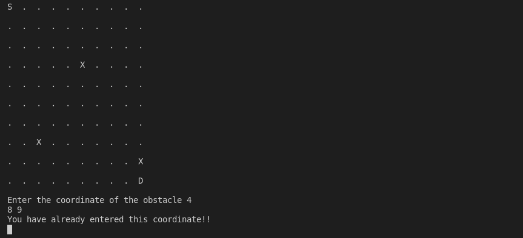

#PATH-FINDER

This project finds an optimal path from starting point to the destination in a 2-D matrix filled with some obstacles which are not be included in the path.

The starting point is represented by 'S'.\
Destination is represented by 'D'.\
Obstacle is represented by 'X'.\
Rest of the coordinates are represented by '.' which can be a part of path.\
Coordinates are zero-indexed.

When the user run the program,it will ask user to input dimension of the matrix,starting coordinates,destination coordinates,Number of obstacles and coordinates of all the obstacles.If the user enter already entered coordinate,it will ask you to reenter the coordinates.

